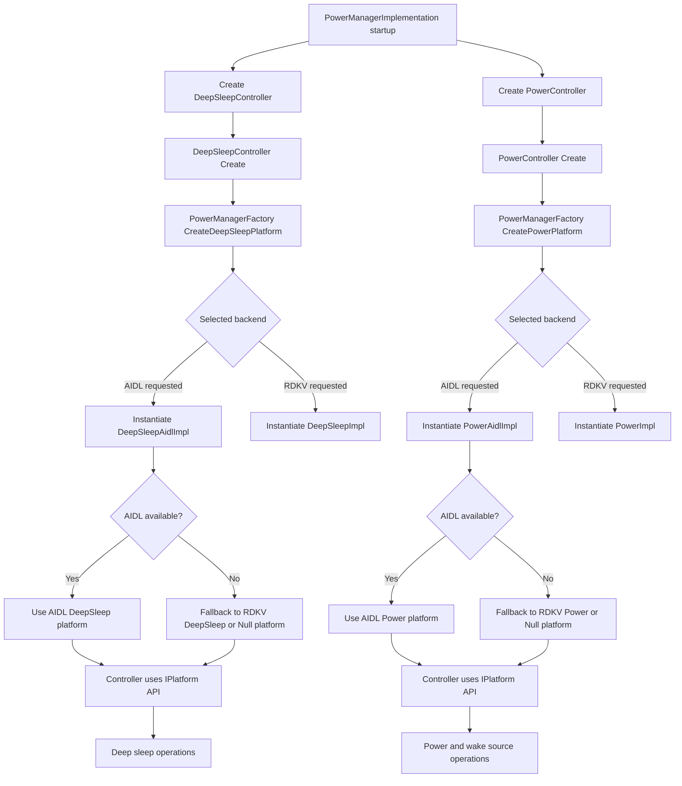

# PowerManager HAL Factory Architecture

## Overview

This document describes the dual-backend HAL architecture introduced for PowerManager, where a factory pattern selects and instantiates either:

- RDKV HAL backend
- AIDL HAL backend

The design keeps controller logic backend-agnostic and centralizes backend selection, fallback, and creation in one place.

## Goals

- Support multiple HAL families without changing controller behavior
- Keep backend-specific code isolated in hal classes
- Allow runtime backend selection with safe fallback
- Preserve current RDKV behavior as default

## Key Components

- PowerManagerImplementation
  - Owns the controller layer and plugin lifecycle
- DeepSleepController
  - Uses hal::deepsleep::IPlatform only
- PowerController
  - Uses hal::power::IPlatform only
- PowerManagerFactory
  - Creates backend-specific platform implementations
  - Handles backend selection and fallback
- Backend implementations
  - RDKV: DeepSleepImpl, PowerImpl
  - AIDL: DeepSleepAidlImpl, PowerAidlImpl

## Class Diagram

```mermaid
classDiagram
    direction LR

    class PowerManagerImplementation {
        -DeepSleepController _deepSleepController
        -PowerController _powerController
    }

    class DeepSleepController {
        -shared_ptr~hal::deepsleep::IPlatform~ _platform
        +Create(parent) DeepSleepController
        +Activate(timeout, nwStandbyMode) uint32_t
        +Deactivate() uint32_t
        +GetLastWakeupReason(reason) uint32_t
    }

    class PowerController {
        -unique_ptr~hal::power::IPlatform~ _platform
        +Create(deepSleep) PowerController
        +SetPowerState(keyCode, state, reason) uint32_t
        +GetPowerState(current, prev) uint32_t
        +SetWakeupSourceConfig(configs) uint32_t
    }

    class PowerManagerFactory {
        +CreateDeepSleepPlatform() shared_ptr~hal::deepsleep::IPlatform~
        +CreatePowerPlatform() unique_ptr~hal::power::IPlatform~
        -SelectedBackend() Backend
    }

    class Backend {
        <<enumeration>>
        RDKV
        AIDL
    }

    class hal::deepsleep::IPlatform {
        <<interface>>
        +SetDeepSleep(timeout, isGPIOWakeup, networkStandby) uint32_t
        +DeepSleepWakeup() uint32_t
        +GetLastWakeupReason(reason) uint32_t
        +GetLastWakeupKeyCode(keyCode) uint32_t
    }

    class hal::power::IPlatform {
        <<interface>>
        +SetPowerState(state) uint32_t
        +GetPowerState(state) uint32_t
        +SetWakeupSrc(type, enabled, supported) uint32_t
        +GetWakeupSrc(type, enabled, supported) uint32_t
    }

    class DeepSleepImpl
    class PowerImpl
    class DeepSleepAidlImpl
    class PowerAidlImpl

    PowerManagerImplementation --> DeepSleepController
    PowerManagerImplementation --> PowerController

    DeepSleepController --> PowerManagerFactory : Create()
    PowerController --> PowerManagerFactory : Create()

    PowerManagerFactory ..> Backend

    DeepSleepController --> hal::deepsleep::IPlatform
    PowerController --> hal::power::IPlatform

    DeepSleepImpl ..|> hal::deepsleep::IPlatform
    PowerImpl ..|> hal::power::IPlatform
    DeepSleepAidlImpl ..|> hal::deepsleep::IPlatform
    PowerAidlImpl ..|> hal::power::IPlatform

    PowerManagerFactory --> DeepSleepImpl : RDKV path
    PowerManagerFactory --> PowerImpl : RDKV path
    PowerManagerFactory --> DeepSleepAidlImpl : AIDL path
    PowerManagerFactory --> PowerAidlImpl : AIDL path
```

## Backend Selection

Backend is selected using this order:

1. Runtime environment variable POWERMANAGER_HAL_BACKEND
   - aidl -> request AIDL backend
   - rdkv -> request RDKV backend
2. Compile-time default (if configured)
3. Safe fallback path

If the requested backend is unavailable, the factory attempts fallback to another compiled backend. If no backend is available, a null platform is returned and APIs report unavailable.

## Runtime Flow Diagram



## Build and Configuration

- AIDL backend build switch:
  - POWERMANAGER_ENABLE_AIDL_HAL
- Runtime backend selector:
  - POWERMANAGER_HAL_BACKEND

Recommended defaults:

- Keep RDKV as default backend in production until AIDL backend coverage is complete
- Enable AIDL backend in integration environments for rollout validation

## Design Benefits

- Single point of backend selection logic
- Controller code remains stable and backend-agnostic
- Reduced regression risk when adding new backends
- Incremental migration path from RDKV HAL to AIDL HAL

## Future Enhancements

- Extend PowerAidlImpl with full platform API mapping for all power state and wake source paths
- Add backend capability probing and telemetry for backend selection decisions
- Add unit tests around factory fallback behavior and null-platform handling
